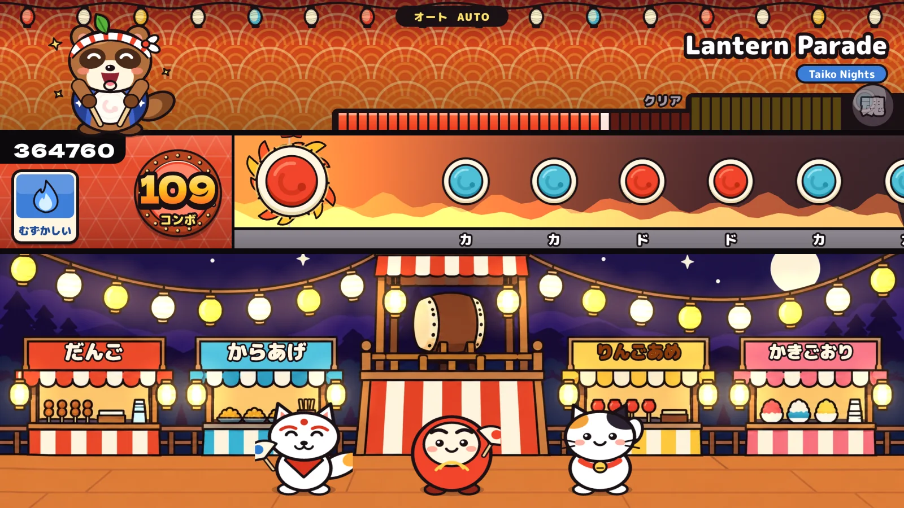
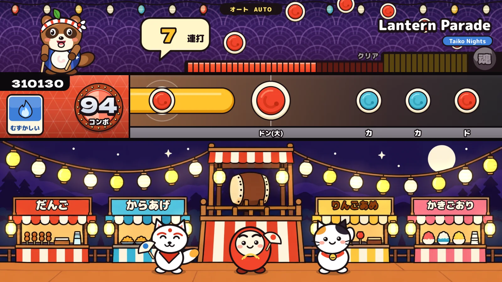
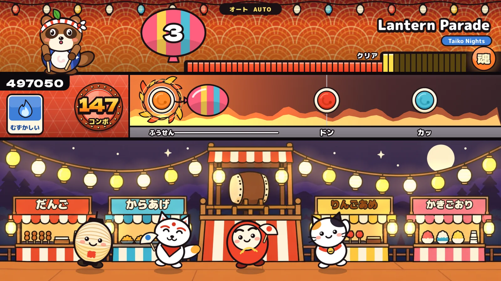
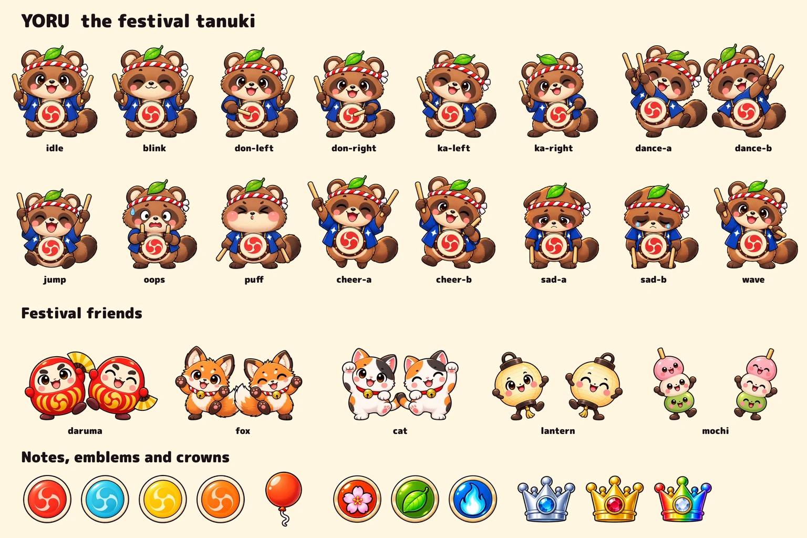
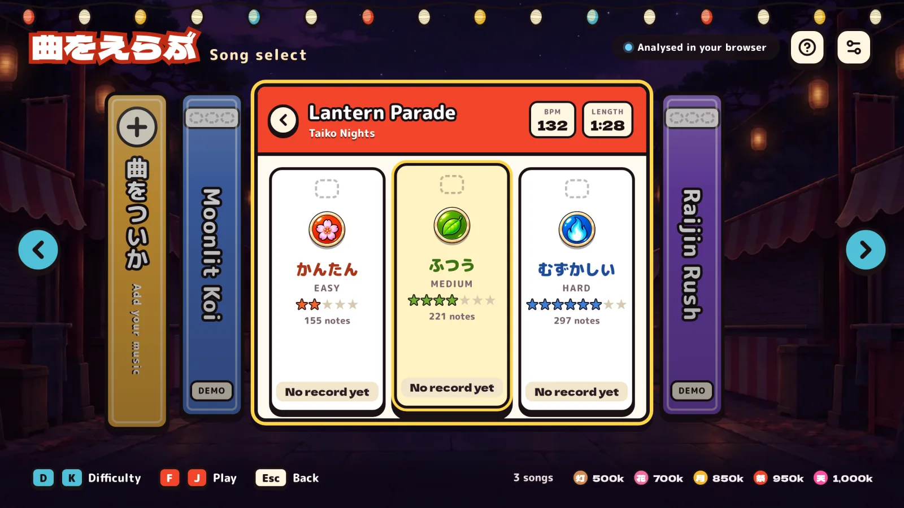
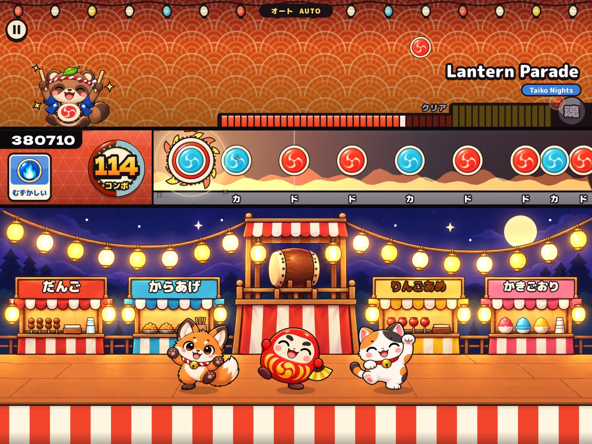
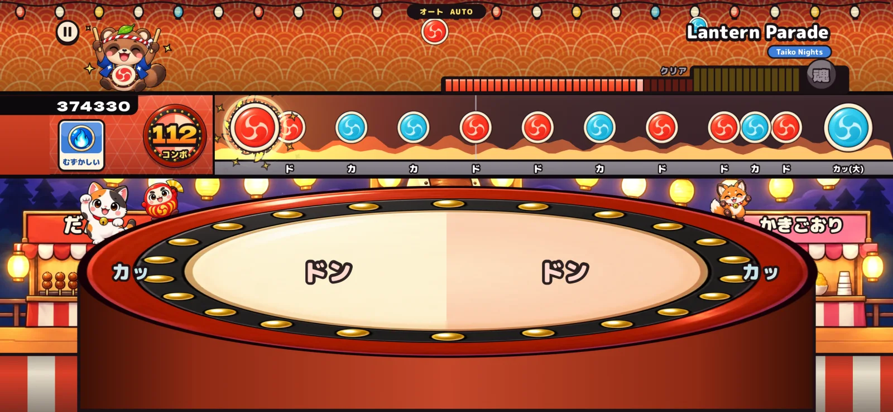
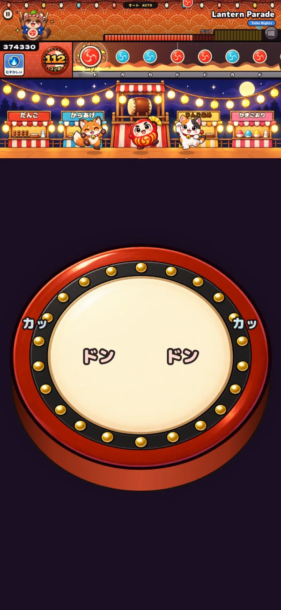

# Taiko Nights

A festival taiko rhythm game for the browser. Add any song, the game finds its beat
and writes Easy, Medium and Hard charts, and you play it with four keys.

**Play it now: https://davidyen1124.github.io/taiko-nights/**



| Drumroll | Balloon |
| --- | --- |
|  |  |

Everything here is original: the code, the mascot (Yoru the tanuki), the festival
friends, the notes and the three built-in songs. The characters, notes, drum and
backgrounds are painted; how they were made is in [docs/art](docs/art/README.md).





The game fills the window at any shape, with no bars. A wider window makes the lane
longer; a taller one adds sky above and a festival curtain below.



## Run it

You need Node 20 or newer. Nothing else: there is no server to set up.

```bash
npm install
```

```bash
npm run dev -- --port 4173
```

Open http://localhost:4173.

## Built-in songs

| Song | Tempo | Feel | Easy | Medium | Hard |
| --- | --- | --- | --- | --- | --- |
| Moonlit Koi | 100 | shuffle, for koto | ★1 | ★3 | ★5 |
| Lantern Parade | 132 | straight, for festival flute | ★2 | ★4 | ★6 |
| Raijin Rush | 168 | straight, for shamisen | ★4 | ★6 | ★8 |

All three were written for this game. Each is a score in `src/game/songs/`: the
melody, the bass and the three charts as plain data. A small synthesiser in the same
folder plays the score sample by sample in a worker, which takes under a second. The
repo and the site carry no audio files and nothing is sampled from a recording.

## Play

| Key | Drum |
| --- | --- |
| `F` `J` | ドン Don, the skin (red notes) |
| `D` `K` | カッ Ka, the rim (blue notes) |
| `F`+`J` or `D`+`K` | Big notes pay double when both sticks land together |
| any drum key, fast | Drumrolls (yellow) |
| `F` `J`, fast | Balloons: hit the skin the number of times shown |
| `Esc` | Pause |

Menus are played like the drum: `D` `K` move, `F` `J` confirm, `Esc` goes back. Arrow
keys and Enter work too.

### On a phone or tablet

A taiko appears on screen. Tap its skin for ドン and its rim for カッ; the left and
right halves are your two hands, so two fingers together play a big note. Nothing is
wasted: a tap anywhere off the skin counts as the rim.

Held sideways, the stage moves up to make room and the festival friends dance behind
the drum. Held upright, the stage sits at the top and the drum sits under it. Either
way the whole head of the drum stays clear of the bottom edge, where a phone listens
for its own gestures, and the score and the pause button keep clear of the notch.

For the full screen, add the game to your home screen (Share, then Add to Home
Screen on an iPhone). It then opens without the browser's bars.

| Sideways | Upright |
| --- | --- |
|  |  |

The drum only appears on devices played with fingers. With a mouse and keyboard it
stays hidden. It can be switched off in Settings; the screen still plays.

Settings hold music and drum volume, note speed, a timing offset with a tap-along
measuring tool, auto play and the on-screen drum. Settings and personal records are kept
in this browser's local storage.

## Your music

Choose **曲をついか / Add your music** on the song shelf and pick a file: MP3, WAV, FLAC,
OGG or M4A, up to 80 MB and 10 minutes.

**The song never leaves your device.** It is read, analysed and saved in your browser.
Nothing is uploaded, because there is nowhere to upload it to: the game is a set of
static files. The chart and the file are kept in the browser's own storage
(IndexedDB), so the song is still on the shelf next time. Removing a song deletes both.

What the game does with a song (`src/game/features.js`, then `src/game/charting.js`,
in a worker):

1. separates percussive sound and measures attacks overall, in the kick band and in
   the high band
2. tracks the beat and fits a steady grid to it
3. checks that tempo against the tempos it is commonly mistaken for: half, double,
   and the two that are three to two
4. finds the downbeat from bass attacks and chord changes
5. places notes on the grid: Easy on beats, Medium adds half-beats, Hard adds
   quarter-beats in short runs. A shuffle is charted in triplets.
6. assigns Don to bass-heavy attacks and Ka to bright ones
7. turns the loudest sections into Go-Go Time, leads into them with a drumroll and
   follows the first two with a balloon

A four-minute song takes one to three seconds.

### What to expect

| Check | Result |
| --- | --- |
| Tempo, 96 to 168 BPM | within 0.3 BPM |
| Beat placement | within 6 ms of the real attack, 4 ms on average |
| Audio at 22.05, 32, 44.1, 48 and 96 kHz | same timing at each |
| Shuffle rhythm | detected, and charted in triplets |
| A fast song in straight eighths (168 BPM) | not taken for a shuffle at 112, whatever the first guess |
| A shuffle (100 BPM) | not taken for a straight song at 150, whatever the first guess |
| Slow and very fast songs (60, 70, 180, 200 BPM) | charted at double or half, so the grid stays playable |

These are measured on drum loops of known tempo and on the three built-in songs
(`npm test`). Real music is harder. Songs with a tempo that drifts fall back to the
tracked beats instead of a fixed grid. Songs with no clear pulse are turned away with
a message rather than given invented notes. If a chart feels early or late on your
speakers, use the timing offset in Settings.

### Limits of keeping songs in the browser

- A song is saved in one browser on one device. It does not follow you to another.
- The browser decides how long it keeps saved data. Safari may clear it after about a
  week without a visit, unless the game is on your home screen.
- A file the browser cannot read (WMA, some AIFF) is turned away with a message.

**Audio is never committed.** `.gitignore` excludes every common audio extension.
Tests synthesise their own audio.

## Rules

| | Easy かんたん | Medium ふつう | Hard むずかしい |
| --- | --- | --- | --- |
| 良 Good window | ±42 ms | ±42 ms | ±25 ms |
| 可 OK window | ±108 ms | ±108 ms | ±75 ms |
| Clear line on the soul gauge | 60% | 70% | 70% |
| A miss costs | half a Good | one Good | 1.25 Goods |

- Scoring is fixed per note: every 良 pays the same and 可 pays half. A flawless run
  with every big note struck two-handed totals 1,000,000 before drumrolls.
- Drumrolls pay 100 a hit (200 for big ones). Balloons pay 300 a hit and 5,000 on the pop.
- Hitting the wrong part of the drum is ignored, not punished.
- Crowns: silver for a clear, gold for a full combo, rainbow for all 良.
- Score stamps: 灯 500k, 花 700k, 月 850k, 祭 950k, 天 1,000,000.

These follow the conventions of the genre, researched in
[docs/references.md](docs/references.md). The score stamps, the artwork and the chart
generator are this game's own.

## Test

```bash
npm test
```

```bash
npm run build && npm run test:sites
```

57 tests of the rules, the analyser, the built-in songs, the layout and the artwork,
and 4 of the hosting build. What was checked in real browsers is recorded in
[docs/qa.md](docs/qa.md).

## Publish

Every push to `main` builds the game and publishes it to GitHub Pages
(`.github/workflows/pages.yml`). The workflow runs the tests first and refuses to
publish if the build contains an audio file.

```bash
npm run build
```

```bash
npm run preview:pages
```

The second command serves the build at http://localhost:4174/taiko-nights/, under the
same path GitHub Pages uses. The build uses relative addresses, so it runs from any
folder on any static host.

## Layout

| Path | What lives there |
| --- | --- |
| `src/game/engine.js` | Rules: judging, scoring, gauge, drumrolls, balloons, auto play |
| `src/game/rules.js` | Every number the rules use |
| `src/game/renderer.js` | The play screen |
| `src/game/layout.js` | Where everything sits, and how the stage fills a window |
| `src/game/art/` | Everything drawn: painted sprites (`sprites.js`), effects, scenery, stand-ins |
| `src/game/touchDrum.js`, `src/ui/TouchDrum.jsx` | The drum on touch screens: where it sits, what a touch plays |
| `src/game/audio.js` | Song clock and synthesised drum sounds |
| `src/game/songs/` | The built-in songs as scores, and the synthesiser that plays them |
| `src/game/features.js` | Listens to a song: tempo, beat grid, attacks per band |
| `src/game/charting.js` | Writes the Easy, Medium and Hard charts |
| `src/library.js`, `src/songStore.js` | The song shelf, and your songs saved in this browser |
| `src/screens/`, `src/ui/` | Title, song select, play, results, dialogs |
| `public/art/` | Painted backgrounds, the drum, and the sprite atlases |
| `tools/art/` | How the pictures were made: prompts, generated sheets, the cutter |
| `src/dev/` | Development tools: sprite gallery and the cut-off text audit |
| `docs/` | Art notes, genre references, QA record, screenshots |

`worker/`, `.openai/` and `scripts/prepare-sites-build.mjs` package the build for
hosting. Any static host serves the whole game.

The pictures were made with Python tools in `tools/art/`, run through
[uv](https://github.com/astral-sh/uv). They are only needed to make new pictures,
never to build or run the game.
