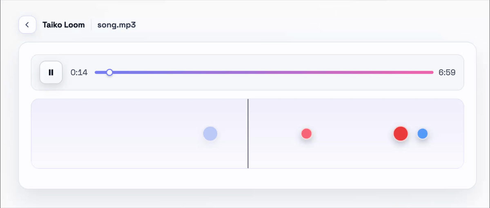

# Taiko Loom



Taiko Loom transforms uploaded MP3s into Taiko-drum-friendly note charts. The backend (FastAPI + `librosa`) analyzes audio, while the frontend (Vite + React) lets players preview charts and drum along from the browser.

## Repo Layout
- `backend/` – FastAPI service in `src/taiko_backend/` (`audio.py`, `jobs.py`, `schemas.py`, `main.py`).
- `frontend/` – Vite/React client in `src/` with `api.ts` handling HTTP calls and `App.tsx` rendering the lane.
- bring your own short MP3 clip for smoke tests (15–30s keeps iterations fast).

## Prerequisites
- [`uv`](https://github.com/astral-sh/uv) (bundled in this repo’s tooling)
- Python 3.11 (managed via `uv`)
- Node.js 18+ and npm
- FFmpeg available on your PATH for reliable MP3 decoding

## Quick Start
1. **Backend**
   ```bash
   cd backend
   uv python install 3.11      # first run
   uv sync                     # installs dependencies into .venv
   uv run fastapi dev taiko_backend.main:app --host 0.0.0.0 --port 8000
   ```
2. **Frontend**
   ```bash
   cd frontend
   npm install
   npm run dev                 # launches Vite on http://localhost:5173
   ```
3. (Optional) For production bundles: `npm run build` followed by `npm run preview`.

Set `VITE_API_BASE_URL` in `frontend/.env.local` (or another Vite env file) if your backend is not on `http://localhost:8000`. Example:
```
VITE_API_BASE_URL=https://your-hosted-backend.example.com
```

## Backend Service Highlights
- `/audio` (POST multipart) accepts `file` plus optional `mode` (`balanced`, `dense`, `sparse`) and immediately returns a job id.
- `/audio/{job}` (GET) lets the frontend poll for status/results.
- Internals:
  - `audio.py` performs beat detection with `librosa` and emits note metadata.
  - `jobs.py` tracks asynchronous processing.
  - `schemas.py` defines Pydantic models for request/response validation.

## Frontend App Highlights
- `src/api.ts` centralizes all API calls and pulls `import.meta.env.VITE_API_BASE_URL`.
- `App.tsx` renders the upload controls, status, and keyboard lane (`F/J` for red hits, `D/K` for blue hits).
- Styling lives in `App.css` and `index.css`; assets go under `public/`.
- Lint before committing: `npm run lint`.

## Manual Verification (No Automated Tests Yet)
1. Run both services (`uv run fastapi dev ...` and `npm run dev`).
2. Upload a short MP3 clip (<30s) to keep iterations fast.
3. Watch the request lifecycle in your devtools: initial `/audio` POST should yield a job id, followed by `/audio/{job}` polling until status is `done`.
4. In the UI, confirm the rendered lane matches expectations across `balanced`, `dense`, and `sparse` modes. Capture screenshots or JSON snippets for PRs when behavior changes.

## Contributing
- Follow the Conventional Commits style used in Git history (`fix(frontend): derive preparedNotes from job payload`).
- Document manual test coverage in PR descriptions (which track, which density mode).
- Refer to `AGENTS.md` for contributor guidelines covering coding style, repo layout, and manual QA expectations.
